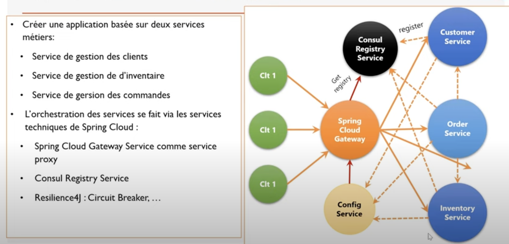
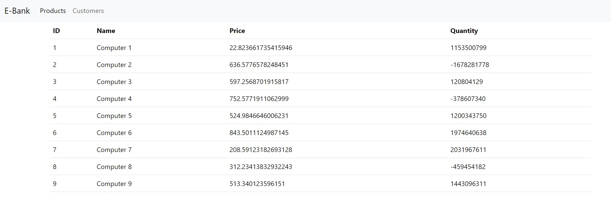
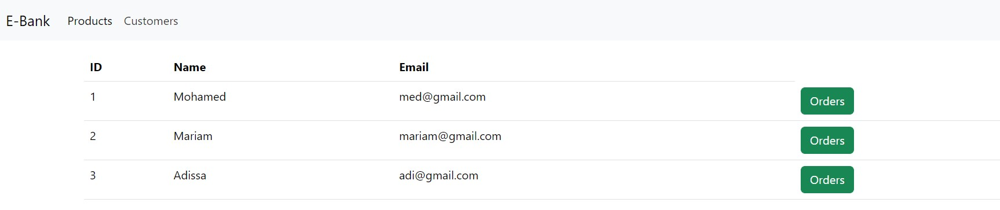

# e-bank-micro-service

Le but de ce travaux pratique est de créer des micro-services qui vont pouvoir s'enregistrer via consul et consulter leur configuration sur config-service. A la fin on doit créer une application Front End en Angular qui va pouvoir communiquer avec notre application.
Voici l'architecture de ce projet

Après la création du back end nous avons créer l'interface Front End avec Angular
Ci-joint l'interface du product

Ci-joint l'interface du customers

Via l'interface du customers on peut consulter les différents commandes (orders) du client.
Ci-joint l'interface du orders

Via l'interface d'orders on peut consulter les différents détails de la commande.
Ci-joint l'interface du orders-details

